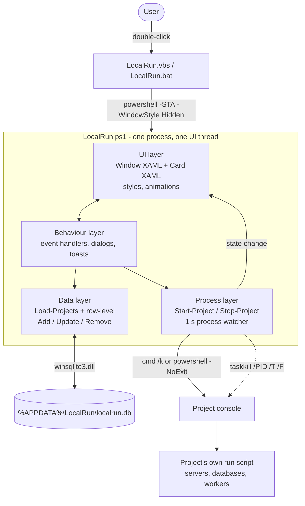

# LocalRun


[](LICENSE)
[](https://github.com/ToukirAhamedPigeon/LocalRun/releases/latest)

A small, free and open-source Windows desktop app that starts your local projects with one click.

Each project keeps its own run command (`.bat`, `.cmd` or `.ps1`) inside its own folder: the script that brings up the app and all its dependencies on localhost. LocalRun is the one place that lists those commands and runs them.

---

## Contents
- [Features](#features)
- [Getting started](#getting-started)
- [Tech stack](#tech-stack)
- [Architecture](#architecture)
- [How it works](#how-it-works)
- [Code map](#code-map)
- [Design decisions](#design-decisions)
- [Limitations](#limitations)
- [Privacy](#privacy)
- [Code signing policy](#code-signing-policy)
- [Roadmap](#roadmap)
- [License](#license)

---

## Features
- ⭐ **Recipes (`localrun.json`):** describe how a project starts (checks, setup steps, services, readiness, profiles) and LocalRun runs it. It starts services in order, waits until each one is ready, keeps a log per service, and stops everything cleanly. Any stack: PHP, Python, Node, .NET, Java, Docker, Android. See [Recipes](#recipes).
- A **Recipe guide** inside the app, with the full rules, 12 ready-made templates, *Save as localrun.json*, and a *Copy AI prompt* button, so an AI assistant can write the recipe for you.
- Add, edit and remove projects (title + recipe or command file). You can also drag a file onto the window to add it.
- **Run** opens the command in its own console window, started from the project's folder.
- A running project glows and shows **Stop**, which closes the console and every process it started.
- Missing command files are flagged, so the same app works across several PCs.
- Footer with copyright, social links and an **About** dialog (version, developer, company). Links open in the browser; no URL is shown in the app.
- No install and no dependencies: it runs on Windows PowerShell 5.1 and WPF, which are built into Windows.

## Getting started

### Install (recommended)
1. Download **`LocalRun-Setup-<version>.exe`** from the [latest release](https://github.com/ToukirAhamedPigeon/LocalRun/releases/latest).
2. Run it and follow the wizard: Welcome → **License and Terms** (you must accept them) → install folder and shortcuts → Install → Finish.
3. Start LocalRun from the Desktop or the Start menu.

- Installs per user to `%LOCALAPPDATA%\Programs\LocalRun`. **No administrator rights needed.**
- Running the setup of a newer version updates an existing install in place. Your saved projects are never touched.
- Uninstall from **Settings → Apps → Installed apps → LocalRun**. You choose whether to keep your saved projects.
- Unattended install: `LocalRun-Setup-<version>.exe -Quiet [-InstallDir <folder>]`. Using `-Quiet` means you accept the [license and terms](TERMS.md).

> **"Windows protected your PC"?** The installer is not code-signed, so Microsoft Defender SmartScreen warns about it the first time. Click **More info → Run anyway**.

### Recipes
A recipe is a `localrun.json` file in the project folder. The smallest one:

```json
{
  "name": "My API",
  "services": [ { "name": "api", "run": "npm run dev", "port": 3000 } ]
}
```

A real one adds **checks** (with a fix hint), **setup** steps that run only when needed, several **services** started in order, each **ready** by port, URL, log line or command, **shared** services such as a database you already run (left alone, never stopped), one-off **tasks** after a service (migrations once the database is up), and **profiles** such as `lan` for testing on a phone over the same Wi-Fi (`${LAN_IP}`).

- Full rules: [docs/recipe-format.md](docs/recipe-format.md), also shown in the app under **Recipe guide → All the rules**.
- Templates: [templates/](templates) for Vite, FastAPI + Vite, Laravel on Laragon, NestJS + PostgreSQL, Django, ASP.NET Core, Spring Boot, Docker Compose, Flutter (Android), React Native (Android), desktop apps, and two projects together.
- Editor support: add `"$schema": "https://raw.githubusercontent.com/ToukirAhamedPigeon/LocalRun/main/schema/localrun.schema.json"` for autocomplete and validation in VS Code.
- With AI: **Recipe guide → Copy AI prompt**, paste it into any assistant with the project's key files, and save the answer as `localrun.json`.

Profiles appear under the **▾** button next to **Run**. The **Logs** button shows each service's output. When a run fails, LocalRun says which step failed, shows the last lines of its log, and stops what it had started.

### Portable (no install)
1. Download **`LocalRun-<version>.zip`** from the release, or clone this repository.
2. Double-click `LocalRun.vbs`. On PCs that block `.vbs` files, use `LocalRun.bat`.
3. Optional: right-click `Install.ps1` → **Run with PowerShell** to add Desktop and Start Menu shortcuts with the LocalRun icon. The shortcuts carry the same taskbar ID as the app, so a pinned LocalRun groups with the running window. Run it again after updating from a version before 1.1.1.

### Building the release files
```powershell
powershell -ExecutionPolicy Bypass -File installer\build.ps1
```
This writes `dist\LocalRun-Setup-<version>.exe` and `dist\LocalRun-<version>.zip`. The version comes from `$AppVersion` in `LocalRun.ps1`. The build needs nothing beyond Windows itself: it compiles the small setup `.exe` with the .NET Framework `csc.exe` that ships with Windows.

| Shortcut | Action |
|---|---|
| `Ctrl+N` | New project |
| `Enter` | Save the open dialog / confirm removal |
| `Esc` | Close the dialog |

---

## Tech stack

| Layer | Technology | Used for |
|---|---|---|
| Runtime | **Windows PowerShell 5.1** | The whole app is a single script. Nothing is compiled or installed. |
| UI framework | **WPF** (`PresentationFramework`, .NET Framework 4.x) | Window, controls, styles, gradients, effects |
| UI markup | **XAML**, parsed at runtime with `XamlReader.Parse` | The main window, plus a separate template for each project card |
| Window chrome | `System.Windows.Shell.WindowChrome` | Custom dark title bar that still keeps native drag, snap and resize |
| Native API | **DWM** (`dwmapi.dll`) and `user32.dll` via `Add-Type` P/Invoke | Rounded corners and border colour on Windows 11; focusing the running window |
| Animation | WPF `DoubleAnimation` + `CubicEase` / `BackEase` / `SineEase` | Card entrance, hover lift, glow pulse, dialogs, toasts, background glows |
| Timing | `DispatcherTimer` | Watching launched processes, hiding toasts |
| Database | **SQLite 3** through Windows' own `winsqlite3.dll`, via a small C# P/Invoke wrapper (`LocalRun.Db`) | The per-machine project list: WAL journal, `synchronous = FULL`, parameterised statements |
| Single instance | Named `System.Threading.Mutex` (`Local\Pigeonic.LocalRun`) | A second launch focuses the open window instead of opening another |
| Taskbar identity | `SetCurrentProcessExplicitAppUserModelID` (`Pigeonic.LocalRun`) + `PKEY_AppUserModel_ID` on the shortcuts (`IPropertyStore`) | LocalRun gets its own taskbar button and icon instead of grouping under PowerShell |
| Logging | Plain text log (`localrun.log`) | Startup, import and database errors |
| Process control | `Start-Process -PassThru`, `cmd.exe /k`, `powershell.exe -NoExit`, `taskkill /T /F` | Running and stopping projects |
| Launcher | **VBScript** (`WScript.Shell.Run`, window style 0) | Starting the app with no console window |
| Shortcuts | `WScript.Shell` COM (`CreateShortcut`) | Desktop and Start Menu shortcuts in `Install.ps1` |
| Icon | Multi-size `.ico` (16–256 px, PNG-encoded frames) | Shortcut and window icon |

---

## Architecture



The app is one PowerShell process with one WPF UI thread. It has four logical layers, all in `LocalRun.ps1`:

1. **UI layer:** two XAML documents. The *window* holds the title bar, header, card list, empty state, drop hint, dialog overlay and toast. The *card* template is parsed once for each project. Shared styles (`FlameBtn`, `GhostBtn`, `IconBtn`, `Field`, and so on) live in the window's resources. Cards reach them through `DynamicResource`, because each card is parsed on its own before it joins the window.
2. **Behaviour layer:** the event handlers for buttons, keyboard, drag-and-drop, dialogs and toasts. Each card button carries its project `Id` in `Tag`, so one shared handler serves every card and no closures are needed.
3. **Data layer:** a SQLite database. Each add, edit or delete writes **only its own row**. The in-memory `ArrayList` of `{ Id, Title, Path }` is always re-read from the database after a change, so it can never overwrite stored data with a stale copy.
4. **Process layer:** launches consoles and keeps an `Id → Process` table of what is running. A one-second timer notices consoles that were closed by hand.

### File structure
```
LocalRun/
├── LocalRun.ps1        # the application (UI, data, process control)
├── engine.ps1          # the recipe engine: checks, setup, services, readiness, logs, stop (no UI)
├── docs/
│   ├── recipe-format.md  # the recipe rules (also the in-app guide and the AI prompt)
│   └── engine-plan.md    # roadmap: detectors + a small local model to write recipes
├── schema/
│   └── localrun.schema.json  # JSON Schema for editor autocomplete and validation
├── templates/          # ready-made recipes per stack, listed in templates/index.json
├── LocalRun.vbs        # hidden-window launcher (normal entry point)
├── LocalRun.bat        # fallback launcher where .vbs is blocked
├── Install.ps1         # portable use: creates Desktop + Start Menu shortcuts on this PC
├── LICENSE             # MIT License
├── TERMS.md            # license + privacy + terms, shown and accepted in the installer
├── .gitignore          # guards against database / log / build files ever being committed
├── .github/workflows/
│   └── build.yml       # CI: builds the installer from source on every tag, signs it via SignPath
├── assets/
│   ├── logo.png        # app logo (title bar, empty state, window icon)
│   └── localrun.ico    # multi-size icon for shortcuts and the setup .exe
└── installer/
    ├── setup.ps1       # the setup wizard (WPF): terms, options, install, register uninstaller
    ├── Bootstrap.cs    # LocalRun-Setup.exe: embeds setup.ps1 + payload.zip, runs the wizard
    ├── Uninstall.ps1   # removes the app, its shortcuts and its Apps entry; optionally the data
    ├── Uninstall.vbs   # what Windows runs from Settings > Apps (runs Uninstall.ps1 from %TEMP%)
    └── build.ps1       # builds dist\LocalRun-Setup-<version>.exe and the portable zip
```

### Installer
`LocalRun-Setup-<version>.exe` is a ~250 KB .NET Framework program compiled by `build.ps1`. It carries `setup.ps1` and a `payload.zip` of the app as embedded resources. When run, it extracts them to a temp folder, starts the wizard with a hidden console, and deletes the temp folder afterwards.

The wizard:
1. Copies the app to the chosen folder (default `%LOCALAPPDATA%\Programs\LocalRun`). It refuses if LocalRun is running from that folder.
2. Creates the Desktop and Start Menu shortcuts, stamped with the `Pigeonic.LocalRun` taskbar ID.
3. Registers LocalRun under `HKCU\...\Uninstall\Pigeonic.LocalRun` with its name, version, publisher, icon, size and uninstall command.

The uninstaller only deletes a folder that contains `LocalRun.ps1` and `Uninstall.vbs`. It only removes the shortcuts Setup recorded, and only if they still point into that folder.

### Data model
Stored per machine in **`%APPDATA%\LocalRun\localrun.db`**, outside the app folder. So the data never goes into git, and the same folder or git clone carries a different list on each PC.

```sql
CREATE TABLE projects (
    id          TEXT PRIMARY KEY,      -- GUID, stable while renamed, edited or running
    title       TEXT NOT NULL,
    path        TEXT NOT NULL,         -- the project's .bat / .cmd / .ps1
    sort_order  INTEGER NOT NULL DEFAULT 0,
    created_at  TEXT NOT NULL,         -- local time, yyyy-MM-dd HH:mm:ss
    updated_at  TEXT NOT NULL
);
CREATE TABLE meta (key TEXT PRIMARY KEY, value TEXT);   -- e.g. json_imported
```

| File in `%APPDATA%\LocalRun` | Purpose |
|---|---|
| `localrun.db` (+ `-wal`, `-shm`) | The database |
| `localrun.log` | Startup line with the project count, plus any import or database error |
| `projects.json.imported` | Backup of the pre-1.1 JSON list, after it was imported |

**How data is kept safe**
- **Row-level writes.** Adding, editing or removing a project touches one row, never the whole list.
- **Durable commits.** WAL journal with `synchronous = FULL`, so a saved change survives a crash or a power cut.
- **One window at a time.** A named mutex stops two windows from holding different copies of the list.
- **Re-read on focus.** Coming back to the window reloads from the database and re-checks which command files exist.
- **Safe migration.** On first start, v1.1 imports the older `projects.json` (and the first prototype's `LocalhostLauncher` list). A JSON file is renamed to `*.imported` only after every project in it is confirmed in the database. If anything fails, the file is left untouched, the reason is logged, and the import is retried on the next start.

> Windows' `winsqlite3.dll` is built with `SQLITE_OMIT_LOCALTIME`, so `datetime('now', 'localtime')` returns NULL there. Timestamps are therefore set from PowerShell.

---

## How it works

### Running a project
The command always starts **in the command file's own folder**, so relative paths inside the script behave the same way as when you double-click it.

| File type | How it is launched | Window |
|---|---|---|
| `.bat`, `.cmd` | `cmd.exe /k title LocalRun - <Title> & "<path>"` | Stays open, titled with the project name |
| `.ps1` | `powershell.exe -NoExit -ExecutionPolicy Bypass -File "<path>"` | Stays open |
| anything else | `Start-Process <path>` (Windows file association) | Not tracked |

Consoles stay open (`/k`, `-NoExit`) so logs remain visible and `Ctrl+C` still works. `-ExecutionPolicy Bypass` applies only to that one process. It does not change the machine's policy.

### Running state
- **A project counts as running while its console process is alive.**
- **Stop** calls `taskkill /PID <console> /T /F`. The `/T` flag ends the whole process tree: the console plus the servers it started (node, dotnet, php, python and so on).
- If you close a console yourself, the watcher notices within a second, and the card returns to *Ready* with a toast.

### Card states
| State | Dot | Card | Button |
|---|---|---|---|
| Ready | grey | plain border | gradient **Run** |
| Running | green, pulsing | flame-gradient border with a pulsing glow | red **Stop** |
| File not found | red | plain border | dimmed **Run** (shows an error when clicked) |

### Animations
- Cards fade and slide in one after another at startup. When you add or edit a project, only that card animates.
- On hover, a card grows slightly and a button's glow brightens.
- Pressing Run makes the card give a short bounce. While the project runs, its glow pulses on a sine wave.
- Dialogs open with a back-eased scale and a fade. A removed card shrinks and fades out.
- Toasts rise from the bottom and hide themselves after about 2.6 seconds.
- Three soft radial glows drift slowly behind the window.

---

## Code map
`LocalRun.ps1` is split into commented sections, in this order:

| Section | Contents |
|---|---|
| native | C# compiled with `Add-Type`: `LocalRun.Native` (DWM, window focus) and `LocalRun.Db` (SQLite wrapper) |
| single instance | Named mutex; a second launch focuses the open window and exits |
| XAML | `$WindowXaml` (window + styles), `$CardXaml` (one project card) |
| helpers | `Animate`, `Stop-Animation`, `Get-Color`, `Get-Brush`, easing objects, tile colour palette |
| data | `Open-Database`, `Import-JsonProjects`, `Load-Projects`, `Add-ProjectRow`, `Update-ProjectRow`, `Remove-ProjectRow`, `Get-Project`, `Test-ProjectFile` |
| window | XAML load, named-element lookup, logo and icon |
| toast | `Show-Toast` + auto-hide timer |
| cards | `New-Card`, `Render-Cards`, `Set-CardState`, `Update-Counts` |
| run / stop | `Start-Project`, `Stop-Project`, process-watcher timer |
| dialogs | `Open-Overlay`, `Close-Overlay`, `Show-Editor`, `Save-Editor`, `Show-DeleteConfirm`, `Confirm-Delete` |
| about + links | `Open-Link`, copyright year, social icon and About dialog wiring (`$Links`, `$AppVersion`) |
| wiring | button, keyboard, drag-and-drop and window events; DWM styling; startup animations |

---

## Design decisions
- **PowerShell + WPF instead of Electron, .NET or Python.** Everything it needs already ships with Windows 10 and 11, so it runs on a locked-down office PC with nothing to install, no build step and no admin rights. The whole app is a folder you can read and edit.
- **WPF, not WinForms.** Gradients, drop-shadow glows, rounded templates and a real animation system. The first version was WinForms, and it looked its age.
- **XAML parsed at runtime.** Keeps the markup declarative without a compiler or a project file.
- **Per-machine data outside the app folder.** The app is portable and shareable through git, while each PC keeps its own project list.
- **SQLite through `winsqlite3.dll` rather than System.Data.SQLite.** Windows 10 and 11 already ship SQLite, so a ~150-line P/Invoke wrapper replaces a NuGet package and its native DLLs. The zero-install promise holds.
- **SQLite instead of the v1.0 JSON file.** The JSON file was rewritten in full on every save, so a window holding a stale or empty list could overwrite good data. Row-level writes plus a single instance close that hole.
- **Own taskbar identity.** LocalRun runs inside `powershell.exe`, so without an explicit AppUserModelID Windows groups its window under PowerShell and shows the PowerShell icon. The app sets `Pigeonic.LocalRun` before its window exists, and `Install.ps1` stamps the same ID on the shortcuts.
- **Script files are ASCII-only.** Windows PowerShell 5.1 reads BOM-less scripts in the system code page, so non-ASCII UI glyphs are written as XAML entities (`&#xE768;`) or `[char]` codes. Project titles in any language, such as Bangla, are stored as UTF-16 text in SQLite and display correctly.

## Limitations
- Windows 10 (1703+) or 11 only, since it needs the built-in `winsqlite3.dll`.
- **Stop** ends processes, not containers. Anything started with `docker compose up -d` keeps running.
- Running state lives in memory. If you close and reopen LocalRun, projects that are still running show as *Ready*, and their consoles have to be closed by hand.
- A script that ends with `exit` closes its console, so the project shows as stopped even if it started background services.
- Only consoles that LocalRun launches are tracked. Other file types open through their Windows association.

## Privacy
This program will not transfer any information to other networked systems unless specifically requested by the user.

- Your project list is stored only on your computer, in `%APPDATA%\LocalRun`.
- LocalRun has no telemetry, analytics, update checks or accounts.
- The social icons in the footer and the About dialog open a page in your web browser only when you click them.

## Code signing policy
Free code signing provided by [SignPath.io](https://signpath.io), certificate by [SignPath Foundation](https://signpath.org).

Release binaries (`LocalRun-Setup-<version>.exe`) are built from this repository by [GitHub Actions](.github/workflows/build.yml) on every version tag, and signed only through that pipeline.

**Team roles**
| Role | Members |
|---|---|
| Committers and reviewers | [Toukir Ahamed Pigeon](https://github.com/ToukirAhamedPigeon) |
| Approvers | [Toukir Ahamed Pigeon](https://github.com/ToukirAhamedPigeon) |

All team members use multi-factor authentication for GitHub and SignPath.

## Roadmap
**One click, any stack.** Instead of a start script per project, a short per-project *recipe* run by a shared engine inside LocalRun. See [docs/engine-plan.md](docs/engine-plan.md).
- ✅ **1.2.0:** the recipe format, the engine, the in-app guide, templates and the AI prompt.
- Next: detectors that draft a recipe from a project's files, then a small, free, fine-tuned local model for the rest, with the whole install kept under 500 MB.

## License
LocalRun is free and open-source software, released under the [MIT License](LICENSE).
Copyright © 2026 Pigeonic - Toukir Ahamed Pigeon.
